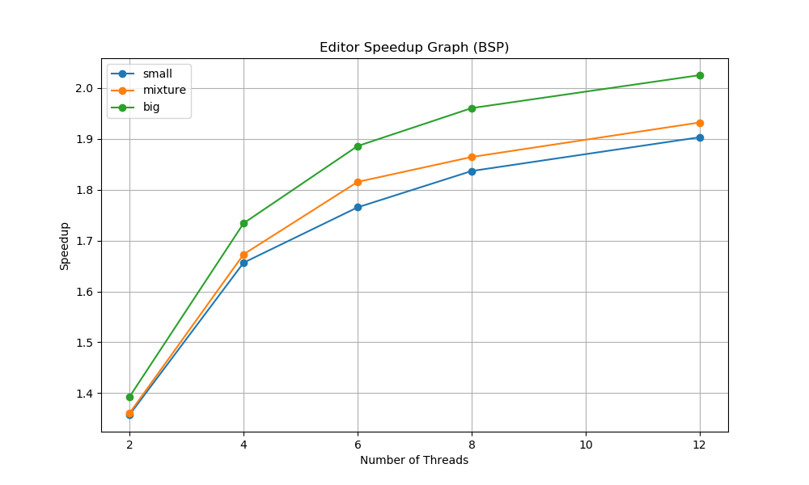

# A Convolutional Image Processing System
The task is to apply image effects on a series of images using 2D image convolutions. The project implements three versions of an image editor that apply convolution effects on given images:

1. **Sequential Version**:  
   - Processes images one at a time without parallelism.  
   - Each image is fully loaded, effects are applied sequentially using convolution operations, and results are saved before moving to the next image.  
   - Serves as the baseline for performance comparisons.

2. **BSP Version**:  
   - Processes an individual image by splitting it into slices.  
   - Each goroutine applies the same effect on its own slice, waits for all slices to complete between effects, and moves on to the next effect instruction together.

3. **BSP + Work-Stealing Version**:  
   - Allows the task (processing a series of images) to be split into smaller tasks, which are placed in a work queue.  
   - Threads steal work from other threads when idle.


## Program Usage
The test runs each image combination of `mode, [number of threads], and data_dir` five times, and outputs the results into text files at `benchmark/results`.

```
Generating testing plots: /proj3/benchmark$: sbatch benchmark-proj3.sh

Usage: go run editor.go data_dir mode [number of threads]

    data_dir = The data directory to use to load the images; use '+' to specify a combination run: go run editor.go big+small pipeline 2

    mode     = (s) run sequentially

               (bsp) process slices of each image in parallel       

               (bspsteal) bsp + work-stealing algorithm

    [number of threads] = Runs the parallel version of the program with the specified number of threads

```
The program will read from a series of JSON strings, where each string
represents an image along with the effects that should be applied to that
image. Each string will have the following format,

``` json
{ 
  "inPath": string, 
  "outPath": string, 
  "effects": [string] 
}
```

For example, processing an image of a sky may have the following JSON
string,

``` json
{ 
  "inPath": "sky.png", 
  "outPath": "sky_out.png",  
  "effects": ["S","B","E"]
}
```

where each key-value is described in the table below,

| Key-Value                     | Description |
|-------------------------------|-------------|
| ``"inPath":"sky.png"``        | The ``"inPath"`` pairing represents the file path of the image to read in. Images in  this assignment will always be PNG files. All images are relative to the ``data`` directory inside the ``proj1`` folder. |
| ``"outPath:":"sky_out.png"``  | The ``"outPath"`` pairing represents the file path to save the image after applying the effects. All images are relative to the ``data`` directory inside the ``proj1`` folder. |
| ``"effects":["S"\,"B"\,"E"]`` | The ``"effects"`` pairing  represents the image effects to apply to the image. You must apply these in the order they are listed. If no effects are specified (e.g.\, ``[]``) then the out image is the same as the input image. |

The program will read in the images, apply the effects associated with
an image, and save the images to their specified output file paths.

The scheduling (i.e., running) of the various implementations is handled
by the `scheduler` package defined in `proj3/scheduler` directory. The
`editor.go` program will create a configuration object using the following struct:

``` go
type Config struct {
  DataDirs string //Represents the data directories to use to load the images.
  Mode     string // Represents which scheduler scheme to use
  ThreadCount int // Runs in parallel with this number of threads
}
```

## Data Source

Inside the `proj3` directory, the dataset directory should be downloaded and placed at the same level as subdirectories `editor` and `png`.
Data can be downloaded: [here](https://www.dropbox.com/s/cwse3i736ejcxpe/data.zip?dl=0).
-   Here is the structure of the `data` directory:

| Directory/Files | Description  |
|-----------------|--------------|
| ``effects.txt`` |  This is the file that contains the string of JSONS that were described above. This will be the only file used for this program (and also for testing purposes). You must use a relative path to your ``proj1`` directory to open this file. For example, if you open this file from the ``editor.go`` file then you should open as ``../data/effects.txt``. |
|  ``expected`` directory | This directory contains the expected filtered out image for each JSON string provided in the ``effects.txt``. We will only test your program against the images provided in this directory. Your  produced images do not need to look 100% like the provided output. If there are some slight differences based on rounding-error then that's fine for full credit. |
|  ``in`` directory | This directory contains three subdirectories called: ``big``, ``mixture``, and ``small``. The actual images in each of these subdirectories are all the same, with the exception of their *image sizes*. The ``big`` directory has the best resolution of the images, ``small`` has a reduced resolution of the images, and the ``mixture`` directory has a mixture of both big and small sizes for different images. You must use a relative path to your ``proj1`` directory to open this file. For example, if you want to open the ``IMG_2029.png`` from the ``big`` directory from inside the ``editor.go`` file then you should open as ``../data/in/big/IMG_2029.png``. |
| ``out`` directory | This is where the program will place the ``outPath`` images when running the program. |

## Image Effects

The sharpen, edge-detection, and blur image effects are required to use
image convolution to apply their effects to the input image.
The size of the input and output image
are fixed (i.e., they are the same). Thus, results around the border
pixels will not be fully accurate since we will need to pad zeros
where inputs are not defined. The grayscale effect uses a
simple algorithm defined below that does not require convolution.

Each effect is identified by a single character that is described below,

| Image Effect | Description |
| -------------|-------------|
| ``"S"`` | Performs a sharpen effect with the following kernel (provided as a flat go array): ``[9]float6 {0,-1,0,-1,5,-1,0,-1,0}``. |
| ``"E"`` | Performs an edge detection effect with the following kernel (provided as a flat go array): ``[9]float64{-1,-1,-1,-1,8,-1,-1,-1,-1}``. |
| ``"B"`` | Performs a blur effect with the following kernel (provided as a flat go array): ``[9]float64{1 / 9.0, 1 / 9, 1 / 9.0, 1 / 9.0, 1 / 9.0, 1 / 9.0, 1 / 9.0, 1 / 9.0, 1 / 9.0}``. |
| ``"G"`` | Performs a grayscale effect on the image. This is done by averaging the values of all three color numbers for a pixel, the red, green and blue, and then replacing them all by that average. So if the three colors were 25, 75 and 250, the average would be 116, and all three numbers would become 116. |


## Sequential Hotspots

The main hotspot in the sequential program is the convolution operation, which requires multiple nested loops and kernel calculations for each pixel.
File I/O operations (reading/writing PNG files) create sequential bottlenecks since loading and writing large image files creates latency.


## Parallel Implementations

### Bulk Synchronous Parallel (BSP)

The BSP pattern is implemented using phase barriers to coordinate parallel execution of image effects where each effect (e.g., blur, edge detection) represents a superstep:

1. Each image is divided into horizontal slices, with each goroutine processing a slice (e.g., `BSPConvolution()` in `effects.go` splits images into `numThreads` slices).  
2. Within `BSPConvolution()`, a reusable `Barrier` struct ensures that the main thread and finished workers wait for all spawned sub-workers to complete their slice processing before advancing to the next effect.  
3. After synchronization, `SwapBuffers()` exchanges input/output buffers for subsequent effects, preserving data consistency.



#### Design Rationale

- This implementation offers advantages in terms of dependency management and predictable latency.  
- Since specific convolutions require neighboring pixels, processing slices without waiting between effects could cause data races. Barriers ensure that no worker starts the next effect until all workers have finished the current one.  
- Additionally, barriers bound the worst-case latency per effect.

#### Trade-off and Limitation

- Using barriers introduces performance trade-offs:
  - Synchronization overhead grows with thread count due to higher contention on the barrier’s mutex/cond variables.
- The limitation of BSP-based design is that `SwapBuffers()` forces all threads to synchronize between effects, which is also a sequential bottleneck.


### BSP + Work-Stealing using Deque

Compared to the pure BSP pattern, this version distributes image tasks (`ImageTask`) round-robin to worker deques. After `RunBSPSteal()` starts:

1. Whenever a worker’s deque is empty, it steals tasks from others’ heads, ensuring high throughput under uneven workloads.

#### Structure of Deque for Work-Stealing Mechanism
A linked list of nodes with atomic operations on head/tail pointers.

#### Operations
- **Push/Pop (LIFO)**: Owner threads add/remove tasks at the tail using `CompareAndSwap` for thread safety.
- **Steal (FIFO)**: Idle threads steal tasks from the head, minimizing contention via atomic pointer swaps.


#### Design Rationale

- The mechanism provides excellent load balancing:
  - ImageTasks vary in size and complexity (e.g., length of effects to apply).  
  - Work-stealing prevents thread starvation when processing a mix of large and small images.
- Per-image task granularity balances parallelism efficiency and synchronization overhead:
  - Instead of dividing individual images into slices for stealing (which risks excessive fragmentation and cache thrashing), each image is treated as an atomic task.
  - Workers process full images sequentially using BSP for intra-image parallelism, preserving spatial locality in pixel data while minimizing deque contention.
- With M images and T threads: Maximum steals ≈ M-T (vs M×T for per-slice stealing).


#### Trade-off and Potential Risks

- Per-image stealing reduces synchronization overhead but may lead to underutilization if some threads are assigned disproportionately large or complex tasks compared to others.
- This design prioritizes simplicity over perfect load balancing:
  - ImageTasks are distributed round-robin.
  - By stealing entire images rather than slices:
    - Workers avoid fine-grained synchronization.
    - Predictable memory access patterns are maintained, which is critical for convolution-heavy effects that introduce pixel dependency.

## Appendix

### Convolution Filter

-   [Two Dimensional
    Convolution](http://www.songho.ca/dsp/convolution/convolution2d_example.html)
-   [Image Processing using
    Convolution](https://en.wikipedia.org/wiki/Kernel_(image_processing))

### Working with Images in Go and Startup Code

As part of the Go standard library, an `image` package is provided that
makes it easy to load,read,and save PNG images:

-   [Go PNG docs](https://golang.org/pkg/image/png/)
-   A [helpful
    tutorial](https://www.devdungeon.com/content/working-images-go)

> **Note**:
> The image package only allows reading an image data and not modify
> it in-place. We will need to create a separate out buffer to represent
> the modified pixels.

``` go
type Image struct {
  in  *image.RGBA64  // Think about swapping these between effects 
  out *image.RGBA64  // Think about swapping these between effects 
  Bounds  image.Rectangle
  ... 
} 
```

Remember these are **pointers** so you only need to swap the pointers to make the old out buffer
the new in buffer when applying one effect after another effect.  This process
is less expensive than copying pixel data after apply each effect.
